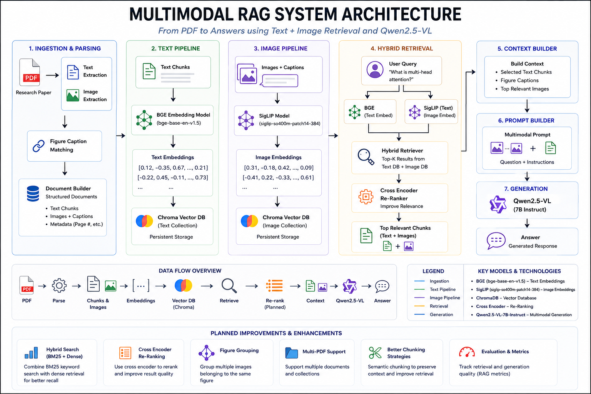

# Multimodal RAG System

A multimodal Retrieval-Augmented Generation (RAG) system capable of retrieving and reasoning over both text and images.

The system extracts text, figures, and visual content from documents, generates modality-specific embeddings, stores them in vector databases, performs hybrid retrieval, and uses a Vision-Language Model (Qwen2.5-VL) for grounded answer generation.

---

## Architecture



---

## Features

### Document Processing

* PDF text extraction using PyMuPDF
* Image extraction from PDFs
* Figure-caption matching
* Structured document element generation

### Text Pipeline

* BGE Embeddings
* Semantic text retrieval
* ChromaDB vector storage

### Image Pipeline

* SigLIP image embeddings
* Cross-modal text-to-image retrieval
* Dedicated image vector database

### Hybrid Retrieval

* Retrieve relevant text chunks
* Retrieve relevant images
* Merge multimodal context

### Multimodal Reasoning

* Qwen2.5-VL integration
* Text + image understanding
* Context-grounded answer generation

---

## Project Structure

```text
app/
├── data/
├── embeddings/
│   ├── embedder.py
│   └── image_embedder.py
│
├── llm/
│   └── qwen_vl.py
│
├── models/
│   └── document_elements.py
│
├── parser/
│   ├── pdf_parser.py
│   └── document_builder.py
│
├── pipeline/
│   ├── text_pipeline.py
│   └── image_pipeline.py
│
├── rag/
│   ├── context_builder.py
│   └── prompt_builder.py
│
├── retriever/
│   ├── text_retriever.py
│   ├── image_retriever.py
│   └── hybrid_retriever.py
│
├── vectorstore/
│   ├── chroma_store.py
│   └── image_store.py
│
└── main.py
```

---

## Workflow

```text
PDF
 │
 ▼
PDF Parser
 │
 ├── Text Extraction
 └── Image Extraction
          │
          ▼
 Caption Matching
          │
          ▼
 Document Builder
          │
 ┌────────┴─────────┐
 ▼                  ▼

Text Pipeline    Image Pipeline
(BGE)            (SigLIP)

 ▼                  ▼

Chroma DB      Image Vector DB

 └──────┬──────────┘
        ▼

 Hybrid Retriever
        │
        ▼

 Context Builder
        │
        ▼

 Qwen2.5-VL
        │
        ▼

 Generated Answer
```

---

## Installation

Clone the repository:

```bash
git clone https://github.com/<your-username>/multimodal-rag.git

cd multimodal-rag
```

Create a virtual environment:

```bash
python -m venv .venv

source .venv/bin/activate
```

Install dependencies:

```bash
pip install -r requirements.txt
```

---

## Running the Project

Place your PDF inside:

```text
app/data/
```

Update the path inside:

```python
app/main.py
```

Run:

```bash
python app/main.py
```

---

## Models Used

| Component             | Model                          |
| --------------------- | ------------------------------ |
| Text Embeddings       | BAAI/bge-base-en-v1.5          |
| Image Embeddings      | google/siglip-base-patch16-224 |
| Vision-Language Model | Qwen/Qwen2.5-VL-7B-Instruct    |
| Vector Database       | ChromaDB                       |

---

## Planned Improvements

* BM25 + Dense Hybrid Search
* Cross Encoder Re-Ranking
* Figure Grouping
* Multi-PDF Collections
* Retrieval Evaluation Framework
* Metadata-Aware Retrieval
* Production API Layer

---

## Tech Stack

* Python
* PyMuPDF
* Transformers
* Sentence Transformers
* SigLIP
* Qwen2.5-VL
* ChromaDB
* PyTorch

---

## License

MIT License
